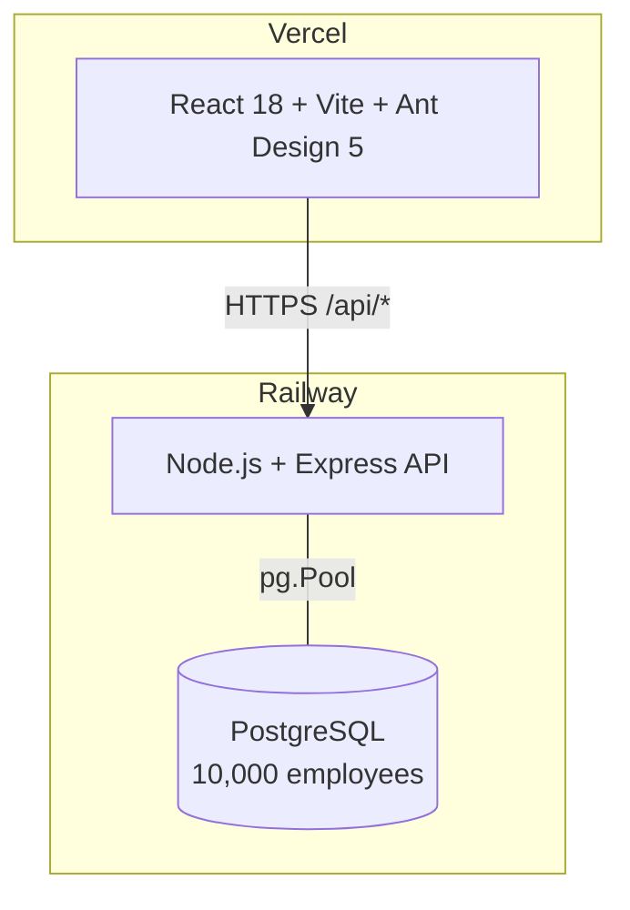

# Salary Management System

Full-stack HR tool to manage 10,000+ employees with salary insights.

**Live demo:** https://salary-management-system-nine.vercel.app

## Stack

- **Backend:** Node.js + Express + PostgreSQL
- **Frontend:** React 18 + Vite + Ant Design 5
- **Tests:** Jest + Supertest (backend) · Vitest + RTL (frontend)
- **Deployed:** Railway (API + Postgres) · Vercel (Frontend)

## Features

- Employee list — search, filter by country/department/type/status, paginated
- Add / Edit / Delete employees
- Dashboard — KPI cards, recent hires trend, salary by country, job title breakdown

## Architecture



| Layer | Service | URL |
|-------|---------|-----|
| Frontend | Vercel | https://salary-management-system-nine.vercel.app |
| Backend API | Railway | https://salary-management-system-production-16db.up.railway.app |
| Database | Railway Postgres | Internal to Railway network |

## Local Setup

**Prerequisites:** Node.js 18+, PostgreSQL 14+

```bash
# 1. Create DB and run migration
createdb salary_mgmt
psql -d salary_mgmt -f backend/migrations/001_create_employees.sql

# 2. Backend
cd backend
cp .env.example .env        # set DATABASE_URL
npm install
npm run seed                # inserts 10,000 employees
npm run dev                 # starts on :3001

# 3. Frontend (new terminal)
cd frontend
npm install
npm run dev                 # starts on :5173
```

## API

| Method | Endpoint | Notes |
|--------|----------|-------|
| GET | `/api/employees` | `page`, `pageSize`, `search`, `country`, `department`, `employmentType`, `status` |
| POST | `/api/employees` | create |
| PUT | `/api/employees/:id` | update |
| DELETE | `/api/employees/:id` | delete |
| GET | `/api/insights/overview` | totals, avg/min/max salary, employment breakdown |
| GET | `/api/insights/by-country` | headcount + salary stats per country |
| GET | `/api/insights/job-title?country=X` | salary stats per job title |
| GET | `/api/insights/recent-hires?months=12` | monthly hire trend |

## Tests

```bash
cd backend  && npm test   # 61 tests
cd frontend && npm test   # 29 tests
```
